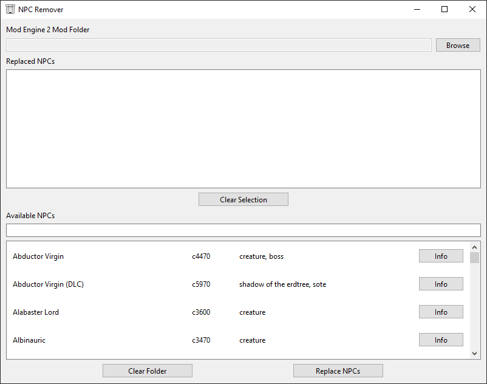
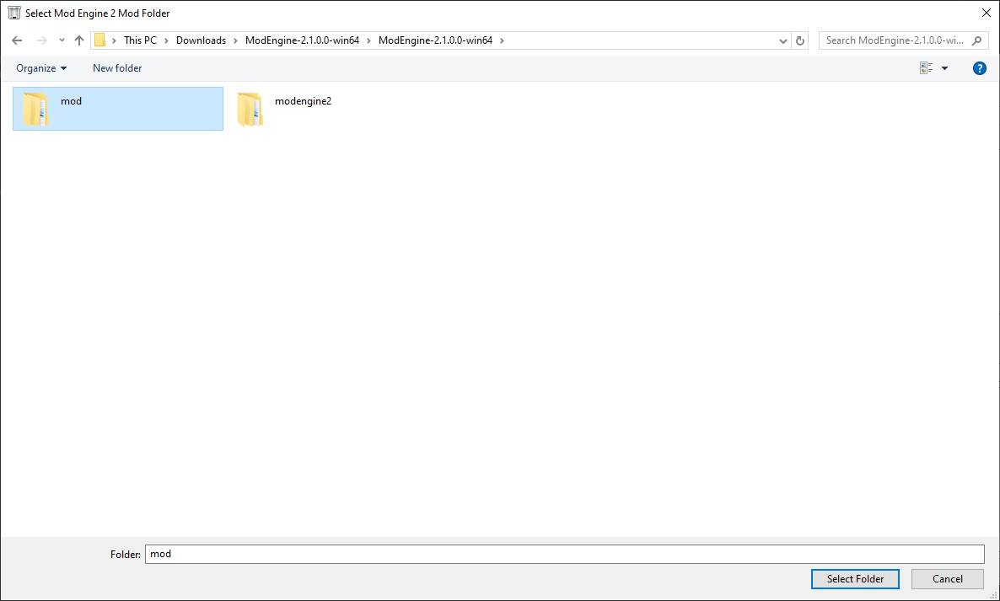

# NpcRemover
An Elden Ring mod which removes any selected NPC.

## Concept
The [original mod](https://www.nexusmods.com/eldenring/mods/4392) worked by replacing the files for a given character using [ModEngine2](https://github.com/soulsmods/ModEngine2). While the original mod works perfectly, it requires the user to find the ID of the NPC they wish to replace and then rename the files to that ID. This adds a bit of friction to the experience. This mod tries to help with this by providing a window which lets you pick the NPCs and then replaces them for you with the click of a button. If you do not wish to run scripts on your computer (despite the fact that the code is provided), I highly encourage checking out the original mod.

## Installation
1. Install [ModEngine2](https://github.com/soulsmods/ModEngine2). Follow the instructions on the page.
2. Install [Python3](https://www.python.org/downloads/). The latest, stable version is the safest choice (it'll be the big download button at the top). I tried not to use too many new features to allow people with older version of Python3 to run the mod, but if you're having problems, I would download the latest version. It is important to note that Python2 and Python3 are completely different, and Python2 is not just and "older version of Python3".
3. Download the [latest release](https://github.com/kazeraniman/NpcRemover/releases) of this mod. Alternatively, download it on NexusMods (link coming soon).
4. Extract the downloaded mod wherever you'd like.
5. If you downloaded from NexusMods, skip this step as the replacement files will come with it. If you downloaded from GitHub, you need a copy of the replacement files.
   1. Grab a copy of the replacement files from the [original mod](https://www.nexusmods.com/eldenring/mods/4392?tab=files). Both the original and turtle forms work, but I recommend the turtle files as it decreases teh chance of softlocking the game.
   2. Extract the replacement files into the `res` folder of this mod. There should be no parent folder; the `.dcx` files should all be directly under the `res` folder.

## Usage
1. To run the mod, run [launch_npc_remover.bat](launch_npc_remover.bat) by double-clicking it. This will install the dependencies and then launch the mod window. If you know Python, feel free to run it yourself, but the `.bat` file takes care of everything for you.
2. Click on the `Browse` button for `Mod Engine 2 Mod Folder` and select the `mod` folder where you have installed ModEngine2. Please keep in mind this should be the `mod` folder inside ModEngine2, not the ModEngine2 folder itself. It is also not the `chr` folder inside the `mod` folder.
3. Use the `Available NPCs` list to select the NPCs you wish to replace. You can use the text box to search for the names, and if you want more information you can click on the `Info` button for an NPC which will open a browser tab to the wiki for that name to give you more information. When you know you want to replace the NPC, click on its row to will move it into the `Replaced NPCs`.
4. If you accidentally added an NPC, click its row in the `Replaced NPCs` list to un-select it. You may also click the `Clear Selection` button to remove all currently selected NPCs.
5. Once you're happy with your replacements, click on the `Replace NPCs` button to perform the replacement.
6. If you wish to clear your replacements that you have previously applied, click on the `Clear Folder` button. **WARNING: This clears everything in the `mod/chr` folder in ModEngine2. This includes other mods you may have installed. Make sure you actually want to clear all of your character mods before selecting this option.**
7. The NPCs should now be replaced. You can close the mod window and the terminal that was opened to run it. The terminal will close when you press any key. It is kept open in case there were errors that you want to send to me for help.
8. Launch your game the normal way you do with ModEngine2 and confirm that everything is working as intended. You will not need to relaunch this mod and perform the replacement steps again unless you want to change the NPCs being replaced.

## Screenshots

  

  

## Attribution
The original idea for this mod and the mod which provides the files to use as replacements is found [here](https://www.nexusmods.com/eldenring/mods/4392) as was uploaded by [Vlobster](https://next.nexusmods.com/profile/Vlobster).  
This mod is a leftover of a mod made by "SolowD" which was named "Remove ants and hands-spiders (not only)" which appears to have since been removed.  
[The ID file](/res/ids.json) is a copy of [Character.json](https://github.com/vawser/Smithbox/blob/main/src/StudioCore/Assets/Aliases/Characters/ER/Character.json) provided by [Smithbox](https://github.com/vawser/Smithbox).
